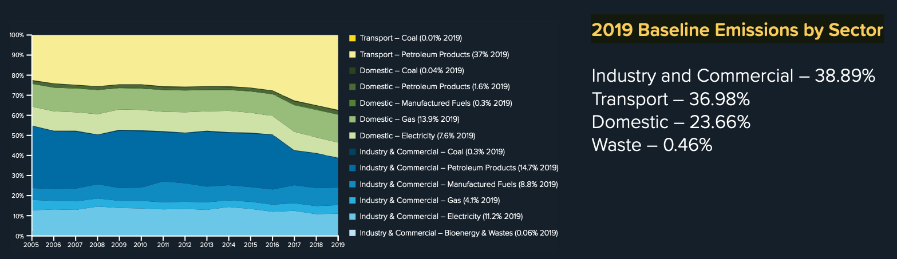

```{r setup, include=FALSE}
startTime <- proc.time()

# Knitr options ----
knitr::opts_chunk$set(echo = FALSE) # code visible?
knitr::opts_chunk$set(warning = FALSE) # no warnings for cleaner output

# Libraries ----
library(data.table)
library(flextable)
library(ggplot2)
library(here)
library(RColorBrewer)
library(skimr)
library(dkUtils) # see https://github.com/dataknut/dkUtils

# Functions ----
source(here::here("R", "functions.R")) # additional local functions

# Parameters ----
rmdParams <- list()

# where is the data?
rmdParams$dataPath <- path.expand("~/Dropbox/data/") # change to suit your context

# latest DESNZ data 
rmdParams$beisData <- "2005-21-local-authority-ghg-emissions-csv-dataset-update-060723.csv"

```

# About

This report is a contribution to the Hampshire County Council Climate Change [Expert Stakeholder Forum](https://www.hants.gov.uk/landplanningandenvironment/environment/climatechange/whoweworkwith/climatechangeforumevent)'s Data sub-group.

Code: https://github.com/HCC-CCECF-DataGroup/hampshire-ghg-emissions/tree/main/rmd (mirrored from https://git.soton.ac.uk/SERG/hcc-engagement/hampshire-ghg-emissions)

If you are viewing this report as a web page then you can also click on the 'code' buttons to reveal the code used in each section.

Feedback: https://github.com/HCC-CCECF-DataGroup/hampshire-ghg-emissions/labels/v2

## History

 * Version 2.0 - [updated to use 2023 DESNZ CO2e data]

## License

This report is (c) University of Southampton and is published under the [CC-BY-4.0 license](https://creativecommons.org/licenses/by/4.0/). You may share, re-use or adapt for commercial or non-commercial purposes with citation.

## Citation

If you wish to use any of the material in this report please cite as:

 * Anderson, Ben (2023) _[Hampshire 'County' GHG Emissions (v2.0): 2018/19 snapshots and trends over time using the latest DESNZ district level data](), Report to the Hampshire County Council Climate Change [Expert Stakeholder Forum](https://www.hants.gov.uk/landplanningandenvironment/environment/climatechange/whoweworkwith/climatechangeforumevent)_. University of Southampton: Southampton.

# Introduction

This report estimates greenhouse gas (GHG) emissions from the Hampshire County using:

 * estimates of total annual _[territorial-based](https://www.ons.gov.uk/economy/environmentalaccounts/articles/netzeroandthedifferentofficialmeasuresoftheuksgreenhousegasemissions/2019-07-24#measuring-the-uks-progress-to-net-zero)_ **CO2e** emissions for the period 2005 onwards using the latest local authority district level data from [DESNZ 2023 data](https://www.gov.uk/government/collections/uk-local-authority-and-regional-greenhouse-gas-emissions-national-statistics);
 * estimates of total annual _[territorial-based](https://www.ons.gov.uk/economy/environmentalaccounts/articles/netzeroandthedifferentofficialmeasuresoftheuksgreenhousegasemissions/2019-07-24#measuring-the-uks-progress-to-net-zero)_ **CO2e** emissions for 2018/19 using the [CSE Impact tool](https://impact-tool.org.uk/download) dataset;
  * estimates of total annual _[consumption-based](https://www.ons.gov.uk/economy/environmentalaccounts/articles/netzeroandthedifferentofficialmeasuresoftheuksgreenhousegasemissions/2019-07-24#the-uks-carbon-footprint)_ **CO2e** emissions for 2018/19 using the [CSE Impact tool](https://impact-tool.org.uk/download) dataset.
  
The analysis is carried out for the 'Wider Hampshire' area, i.e. _all 14_ local authority districts in the Hampshire County **including the unitary authorities of Portsmouth, Southampton and the Isle of Wight**. Note that this differs from the baseline estimated for the Hampshire County Council [Climate Change Strategy](https://www.hants.gov.uk/landplanningandenvironment/environment/climatechange/whatarewedoing/climatechangestrategy) by The Carbon Trust which _excluded_ Portsmouth, Southampton and the Isle of Wight. 

# Carbon Trust estimates

As background to the Hampshire County Council [Climate Change Strategy](https://www.hants.gov.uk/landplanningandenvironment/environment/climatechange/whatarewedoing/climatechangestrategy), the Carbon Trust was asked to establish baseline emissions for the County **excluding Southampton, Portsmouth and Isle of Wight**. This baseline was converted to the proportion of emissions from different energy sources and reported as a trend plot on p14 of the Strategy as shown below. This highlighted that the main components of emissions were:

 * Industry & Commercial (~ 39%) 
 * Transport (~ 37%)
 * Residential energy use (~ 24%). 
 
Total kT CO2e baseline values were not included in this report.



```{r hccCT}
# imputed from values given in https://documents.hants.gov.uk/climate-change/ClimateChange-Strategic-Framework-of-Programmes.pdf

hampshire_CT_terr_Totals <- data.table::fread(here::here("data","inputs", "ClimateChange-Strategic-Framework-of-Programmes_imputed_Carbon_2019.csv"))
ct_transport <- hampshire_CT_terr_Totals[compareLab == "Transport", .(ktco2_CT)]
ct_res <- hampshire_CT_terr_Totals[compareLab == "Residential", .(ktco2_CT)]
ct_ind <- hampshire_CT_terr_Totals[compareLab == "Industry & Commercial", .(ktco2_CT)]

ct_total <- ct_transport + ct_res + ct_ind

ct_transport_pc <- round(100*(ct_transport/ct_total))
ct_res_pc <- round(100*(ct_res/ct_total))
ct_ind_pc <- round(100*(ct_ind/ct_total))
```

However the HCC Climate [Change Strategic Framework of Programmes](https://www.hants.gov.uk/landplanningandenvironment/environment/climatechange/whatarewedoing/strategicpriorities) which lays out the estimated Total kT CO2e and % reduction for a range of proposed actions, enables the following baseline values to be imputed:

 * Industry & Commercial emissions = `r dkUtils::tidyNum(ct_ind,0)` kT CO2
 * Transport emissions = `r dkUtils::tidyNum(ct_transport,0)` kT CO2
 * Residential emissions = `r dkUtils::tidyNum(ct_res,0)` kT CO2

Using the proportion values in the figure above, this gives a total of `r dkUtils::tidyNum(ct_total,0)` kT CO2 for the 11 districts.

# DESNZ: Territorial CO2 emissions (2005 to current)

These official local authority/district level [DESNZ National Statistics](https://www.gov.uk/government/collections/uk-local-authority-and-regional-greenhouse-gas-emissions-national-statistics) use the end-user territorial emissions method(_"meaning CO2 emissions that occur within the UK’s borders"_). As a result international aviation and shipping are _excluded_ from these estimates.

Note also that:

"_The end user basis for reporting emissions has been chosen for this dataset because it accounts for the emissions from energy use at the local level and does not penalise local areas for emissions from the production of energy which is then ‘exported’ to and used in other areas._" ([technical report](https://assets.publishing.service.gov.uk/government/uploads/system/uploads/attachment_data/file/1168163/uk-local-and-regional-ghg-emissions-2005-to-2021-technical-report.pdf), p8)

The following code loads the data and reports basic checks. A full data description can be found in Section \@ref(skimDesnz).

```{r loadDESNZ}
# load the data here so we can easily re-run Rmd chunks ----
#> BEIS/DESNZ latest ----
#> # source: https://www.gov.uk/government/statistics/uk-local-authority-and-regional-greenhouse-gas-emissions-national-statistics-2005-to-2021
#> # first version to include all CO2, CH4 & NO back to 2005
ghgFile <- path.expand("~/Library/CloudStorage/Dropbox/data/beis/localAuthority/allGHG/2005-21-local-authority-ghg-emissions-csv-dataset-update-060723.csv")
desnz_orig <- copy(la_ghg_DT) # for skim in appendix
la_ghg_DT <- data.table::fread(ghgFile) 

la_ghg_DT[, sectorLabel := `LA GHG Sector`]
la_ghg_DT[, subSectorLabel := `LA GHG Sub-sector`]

rmdParams$minYear <- min(la_ghg_DT$`Calendar Year`)
rmdParams$maxYear <- max(la_ghg_DT$`Calendar Year`)
```

```{r processBEIS}
# amend category labels for clarity and ordering
# la_ghg_DT[, subSectorLabel := ifelse(subSectorLabel == "Agriculture",
#      "Industry: Agriculture",
#      subSectorLabel)
#      ]
la_ghg_DT[, subSectorLabel := ifelse(subSectorLabel == "Large Industrial Installations",
     "Industry: Large Industrial Installations",
     subSectorLabel)
]
la_ghg_DT[, subSectorLabel := ifelse(subSectorLabel == "Road Transport (A roads)",
     "Transport: (A roads)",
     subSectorLabel)
]
la_ghg_DT[, subSectorLabel := ifelse(subSectorLabel == "Road Transport (Minor roads)",
     "Transport: (Minor roads)",
     subSectorLabel)
]
la_ghg_DT[, subSectorLabel := ifelse(subSectorLabel == "Road Transport (Motorways)",
     "Transport: (Motorways)",
     subSectorLabel)
]
la_ghg_DT[, subSectorLabel := ifelse(subSectorLabel == "Diesel Railways",
     "Transport: Diesel Railways",
     subSectorLabel)
]

la_ghg_DT[, subSectorLabel := ifelse(subSectorLabel == "Transport 'Other'",
     "Transport: other",
     subSectorLabel)
]

la_ghg_DT[, subSectorLabel := ifelse(subSectorLabel == "Landfill",
     "Waste: Landfill",
     subSectorLabel)
]

la_ghg_DT[, subSectorLabel := ifelse(subSectorLabel == "Waste management 'Other'",
     "Waste: other",
     subSectorLabel)
]

la_ghg_DT[, la_name := `Local Authority`]


# set up the colours

# original code & colours borrowed from https://git.soton.ac.uk/twr1m15/la_emissions_viz/-/blob/master/shiny/app.R
# for details, use set for each sector
agric_pal <- RColorBrewer::brewer.pal(n = 5, name = "BuGn")[1:5]    # industry, 5 categories 
commercial_pal <- RColorBrewer::brewer.pal(n = 3, name = "RdPu")[1:3]    # commercial , 3 categories
domestic_pal <- RColorBrewer::brewer.pal(n = 4, name = "Blues")[2:4]    # domestic , 3 categories
industry_pal <- RColorBrewer::brewer.pal(n = 4, name = "Greys")[1:4]    # industry , 4 categories 
lulucf_pal <- RColorBrewer::brewer.pal(n = 8, name = "Greens")[1:8]     # lulucf , 8 categories
public_pal <- RColorBrewer::brewer.pal(n = 3, name = "Purples")[1:3]    # public , 3 categories
transport_pal <- RColorBrewer::brewer.pal(n = 5, name = "Oranges")[2:6] # transport , 5 categories
waste_pal <- RColorBrewer::brewer.pal(n = 3, name = "Reds")[1:2] # waste , 2 category


# for details, combine sets
desnz_emissions_colours <- c(agric_pal, commercial_pal, domestic_pal, industry_pal, lulucf_pal, public_pal, transport_pal, waste_pal)

catList <- unique(la_ghg_DT$subSectorLabel) # this is not alphabetical - why?
# select colours to be in the correct order
catList2 <- c(catList[1:18],catList[32] , catList[19:24], catList[31] , catList[25:30])

names(desnz_emissions_colours) <- catList2

rmdParams$yearRange <- paste0(min(la_ghg_DT$`Calendar Year`, na.rm = TRUE), 
                              "-",
                              max(la_ghg_DT$`Calendar Year`, na.rm = TRUE)
                              )

# get just the 'wider Hampshire' (Solent) districts
hampshire_la_ghg_DT <- getSolent(la_ghg_DT)
# set a flag for the 11 districts in case we need it
hampshire_la_ghg_DT[, widerHampshire := ifelse(la_name == "Southampton" |
                                                      la_name == "Portsmouth" |
                                                      la_name == "Isle of Wight",
                         "Wider Hampshire",
                         "Hampshire CC")]
message("Number of emissions categories: ", uniqueN(hampshire_la_ghg_DT$`LA GHG Sub-sector`))
message("Number of districts: ", uniqueN(hampshire_la_ghg_DT$`Local Authority`))
message("Total emissions for 2019: ", round(sum(hampshire_la_ghg_DT[`Calendar Year` == 2019]$`Territorial emissions (kt CO2e)`)), " kT CO2")
message("Total emissions deemed to be 'within the scope of influence of LAs' for 2019: ", round(sum(hampshire_la_ghg_DT[`Calendar Year` == 2019]$`CO2 emissions within the scope of influence of LAs (kt CO2e)`)), " kT CO2")

```


DESNZ have produced a useful [mapping tool](https://naei.beis.gov.uk/laco2app/) which can be used to compare the spatial distribution of different emissions sources at district level.

## Trends over time

Figure \@ref(fig:hampshireDNZESCO2TotalTrends) shows trends over the period 2005 to 2019 for the CO2 emissions sources in the data. Overall there has been a clear reduction in emissions over the time period. The categories have been colour-coded so that related categories have similar colours in the palette.

```{r hampshireDNZESCO2TotalTrends, fig.height = 6, fig.cap = "CO2e emissions by category (Hampshire)"}
h_dnzes_sum_allYears_DT <- hampshire_la_ghg_DT[, .(`Total kT CO2e` = sum(`Territorial emissions (kt CO2e)`, na.rm = TRUE)), keyby = .(`Calendar Year`, subSectorLabel)]

p <- ggplot2::ggplot(h_dnzes_sum_allYears_DT, aes(x = `Calendar Year`, 
                       y = `Total kT CO2e`,
                       fill = subSectorLabel)) +
  geom_col(position = "stack") +
  scale_fill_manual(values = desnz_emissions_colours) +
  theme(legend.position = "bottom", ) +
  guides(fill=guide_legend(ncol=3)) +
  theme(legend.title = element_blank()) +
  labs(x = "LA GHG Sub-sector")

ggplot2::ggsave(here::here("plots", "beis", 
                           paste0(rmdParams$yearRange, "_trendsCol.png")
                           ), plot = p)
p

# save this data out for future use
data.table::fwrite(h_dnzes_sum_allYears_DT, here::here("data","outputs", "all_hampshire_dnzes_categories_sum_kTCO2_allYears.csv"))
```

Figure \@ref(fig:hampshireDNZESCO2TotalTrendsLine) shows trends over time for these categories using a line plot to make it easier to see which categories have declined. This makes the recent trends in the reduction of emissions from the increasingly decarbonised electricity grid clearly visible. There has also been a slight decline in emissions due to domestic gas use but few other sources show substantial change except for '_large industrial installations_'.

```{r hampshireDNZESCO2TotalTrendsLine, fig.height = 6, fig.cap = "CO2e emissions by category (Hampshire)"}
p <- ggplot2::ggplot(h_dnzes_sum_allYears_DT, aes(x = `Calendar Year`, 
                       y = `Total kT CO2e`,
                       colour = subSectorLabel)) +
  geom_line() +
  scale_colour_manual(values = desnz_emissions_colours) +
  theme(legend.position = "bottom", ) +
  guides(colour=guide_legend(ncol=3)) +
  theme(legend.title = element_blank()) +
  labs(x = "LA GHG Sub-sector")

ggplot2::ggsave(here::here("plots", "beis", 
                           paste0(rmdParams$yearRange, "_trendsLine.png")
                           ), plot = p)
p
```

Figure \@ref(fig:hampshireDNZESCO2TotalTrendsLinePlotly) shows an interactive version of the same plot. Hovering over specific lines is useful for identifying the sources.

```{r hampshireDNZESCO2TotalTrendsLinePlotly, fig.height = 6, fig.cap = "CO2e emissions by category (Hampshire)"}
library(plotly)
plotly::ggplotly(p)
```

## 2019 baseline

Table \@ref(tab:hampshireDNZESCO2Total) shows the total CO2 emissions under this method for 2019 for all `r uniqueN(hampshire_la_ghg_DT$la_name)` districts. 

```{r hampshireDNZESCO2Total}
t <- hampshire_la_ghg_DT[`Calendar Year` == 2019, .(`Total kT CO2e` = sum(`Territorial emissions (kt CO2e)`, na.rm = TRUE))]
makeFlexTable(t, cap = "CO2e emissions (kT, 2019)")

sumdesnz_kt <- sum(hampshire_la_ghg_DT[`Calendar Year` == 2019]$`Territorial emissions (kt CO2e)`)

sum_within_infl <- sum(hampshire_la_ghg_DT[`Calendar Year` == 2019]$`Emissions within the scope of influence of LAs (kt CO2)`)
```

Note that the total emissions deemed to be 'within the scope of influence of LAs' for 2019 is `r dkUtils::tidyNum(round(sum_within_infl),0)` kT CO2e. Categories deemed by DESNZ to be outside local authorities' scope of influence in this data are:

 * all forms of land-use, land-use change and forestry
 * Transport: (Motorways)
 * Transport: Diesel Railways
 
Table \@ref(tab:hampshireDNZESCO2TotalByCat) shows the total emissions for 2019 ordered by category. Figure \@ref(fig:hampshireDNZESCO2TotalByCat) shows the data as a bar plot ordered by value. The largest emissions sources under this method are clearly visible (domestic gas, transport and domestic electricity).

```{r hampshireDNZESCO2TotalByCat, fig.cap = "CO2e emissions by category (Hampshire, 2019 ordered by emissions value)"}

makeOrderedBarPlot <- function(dt, year){
  res <- list()
  
  absTotal <- sum(dt[, abs(`Total kT CO2e`)])
  
  dt[, `% of gross` := 100*(`Total kT CO2e`/absTotal)]
  
  res$ft <- makeFlexTable(dt[, .(Source = subSectorLabel, 
                           `Total kT CO2e`, `% of gross`)], 
                cap = paste0("CO2e emissions sorted by category (Hampshire, ", year , ")")
  )
  
  res$p <- ggplot2::ggplot(dt, 
                       aes(x = reorder(subSectorLabel, -`Total kT CO2e`), 
                           y = `Total kT CO2e`,
                           fill = subSectorLabel)) +
    geom_col() +
    scale_fill_manual(values = desnz_emissions_colours) +
    theme(legend.position = "none") +
    labs(x = "LA GHG Sub-sector",
         caption = paste0("Hampshire ", year)) +
    coord_flip()
  return(res)
}

plotDT <- hampshire_la_ghg_DT[`Calendar Year` == 2019, .(`Total kT CO2e` = sum(`Territorial emissions (kt CO2e)`, na.rm = TRUE)), keyby = .(subSectorLabel)]

res <- makeOrderedBarPlot(plotDT, year = 2019)
res$ft
res$p
ggplot2::ggsave(here::here("plots", "beis2019_col.png"))


# p <- ggplot2::ggplot(subsetDT, aes(x = `Calendar Year`, y = `Territorial emissions (kt CO2e)`,
#                             fill = subSectorLabel,
#                             colour = subSectorLabel)) +
#   geom_col(position = "stack") +
#   scale_colour_manual(values = desnz_emissions_colours) +
#   scale_fill_manual(values = desnz_emissions_colours) #
# p
latestYear <- max(hampshire_la_ghg_DT$`Calendar Year`)
```

Figure \@ref(fig:dnzesCumulativeDot) shows a cumulative emissions plot for the DESNZ 2019 data ordered by the emissions source's magnitude. The largest increments are therefore due to domestic gas use and various forms of transport. The plot uses vertical lines to show the sources which comprise 50%, 75% and 90% of the total emissions. The plot curls due to the source categories with negative emissions such that the final point represents the total 'net' emissions.

```{r dnzesCumulativeDot, fig.cap="Plot of cumulative emissions (DESNZ, 2019)"}

makeOrderedDotPlot <- function(dt, year){
  t <- dt[order(-`Total kT CO2e`)]
t[, cumulative := cumsum(`Total kT CO2e`)]

grossTerrEm <- sum(t[`Total kT CO2e` > 0, `Total kT CO2e`])

pc_50 <- 0.5*grossTerrEm
pc_75 <- 0.75*grossTerrEm
pc_95 <- 0.95*grossTerrEm

p <- ggplot2::ggplot(t, aes(x = reorder(subSectorLabel, -`Total kT CO2e`), 
                       y = cumulative,
                       colour = subSectorLabel)) +
  geom_point() +
  ylim(0,NA) +
  scale_colour_manual(values = desnz_emissions_colours) +
  theme(legend.position = "none") +
  labs(x = "Emissions source",
       y = "Cumulative T CO2e/annum",
       caption = paste0("Vertical lines = % of gross emissions",
                        "\nHampshire ", year)
       ) +
  coord_flip()


# add reference lines
p <- p + 
  geom_hline(aes(yintercept = pc_50), colour = "grey") +
  geom_hline(aes(yintercept = pc_75), colour = "grey") +
  geom_hline(aes(yintercept = pc_95), colour = "grey") +
  # locate on a category that is always likely to be near the top (small)!
  annotate("text", x = "LULUCF Net Emissions: Indirect N2O", y = pc_50-1.4, label = "50%", colour = "grey") +
  annotate("text", x = "LULUCF Net Emissions: Indirect N2O", y = pc_75-1.4, label = "75%", colour = "grey") +
  annotate("text", x = "LULUCF Net Emissions: Indirect N2O", y = pc_95-1.4, label = "95%", colour = "grey")
return(p)
}

makeOrderedDotPlot(plotDT, 2019)


```


```{r discDESNZCO2e}
h_dnzes2019 <- hampshire_la_ghg_DT[`Calendar Year` == 2019]
h_dnzes_allYears <- hampshire_la_ghg_DT[, .(kT_co2_dnzes = sum(`Territorial emissions (kt CO2e)`)), keyby = .(`Calendar Year`, `LA GHG Sub-sector`)]

desnz_trans <- sum(h_dnzes2019[`LA GHG Sub-sector` %like% "Motorway" | `LA GHG Sub-sector` %like% "roads", `Territorial emissions (kt CO2e)`])

desnz_motorways <- sum(h_dnzes2019[`LA GHG Sub-sector` %like% "Motorway", `Territorial emissions (kt CO2e)`])

desnz_d_gas <- sum(h_dnzes2019[`LA GHG Sub-sector` %like% "Domestic Gas", `Territorial emissions (kt CO2e)`])
desnz_d_elec <- sum(h_dnzes2019[`LA GHG Sub-sector` %like% "Domestic Electricity", `Territorial emissions (kt CO2e)`])

desnz_forest <- sum(h_dnzes2019[`LA GHG Sub-sector` %like% "Forest", `Territorial emissions (kt CO2e)`])

desnz_grassland <- sum(h_dnzes2019[`LA GHG Sub-sector` %like% "Grass", `Territorial emissions (kt CO2e)`])

desnz_wetlands <- sum(h_dnzes2019[`LA GHG Sub-sector` %like% "Wetland", `Territorial emissions (kt CO2e)`])

desnz_crop <- sum(h_dnzes2019[`LA GHG Sub-sector` %like% "Crop", `Territorial emissions (kt CO2e)`])

h_dnzes2019[, zeroC := ifelse(`LA GHG Sub-sector` %like% "Gas",
                             0,
                             `Territorial emissions (kt CO2e)`)]

h_dnzes2019[, zeroC := ifelse(`LA GHG Sub-sector` %like% "Electricity",
                             0,
                             `Territorial emissions (kt CO2e)`)]

h_dnzes2019[, zeroC := ifelse(`LA GHG Sub-sector` %like% "roads",
                             0,
                             `Territorial emissions (kt CO2e)`)]

desnz_allSum <- sum(h_dnzes2019$`Territorial emissions (kt CO2e)`)
zeroCsum <- sum(h_dnzes2019$zeroC)
```

Thus, if we focus on territorial CO2e only then 75% of emissions are due to:

 * Domestic gas: `r dkUtils::tidyNum(desnz_d_gas,0)` kT (`r round(100*(desnz_d_gas/desnz_allSum))` %));
 * Transport (Motorways, A roads and minor roads combined): `r dkUtils::tidyNum(desnz_trans,0)` kT (Total: `r round(100*(desnz_trans/desnz_allSum))` %);
 * Domestic electricity: `r dkUtils::tidyNum(desnz_d_elec,0)` kT (`r round(100*(desnz_d_elec/desnz_allSum))` %))

Taken together the domestic (residential) emissions comprise `r round(100*((desnz_d_gas + desnz_d_elec)/desnz_allSum))` % of the estimated total.

Negative CO2 emissions (sequestration) sources are:

 * Forest: `r dkUtils::tidyNum(desnz_forest,0)` kT
 * Grassland: `r dkUtils::tidyNum(desnz_grassland,0)` kT - note that this does not include methane emissions from grazing livestock nor N2O emissions from waste
 * Wetlands: `r dkUtils::tidyNum(desnz_wetlands,3)` kT - this is perhaps surprisingly small given the coastal nature of the County and the existence of a number of wetland habitats. it may be worth investigating [the underlying data](https://naei.beis.gov.uk/reports/reports?report_id=1025) to confirm.

As Figure \@ref(fig:dnzesCumulativeDot) showed, these levels of sequestration currently provide a negligible offset to the overall emissions. Note also that cropland was a net emitter at `r dkUtils::tidyNum(desnz_crop,0)` kT. 

Figure \@ref(fig:hampshireDNZESCO2TotalTrendsLine) showed that the only emissions sources showing substantial decreases over time have been electricity due to grid decarbonisation and (potentially) reductions in some industrial activity as well as the use of 'Other fuels' by industry. Although emissions from domestic gas use have also fallen over time they appear to have stabilised since 2014. Perhaps of most concern given their dominant contribution however is the relative stability of road transport emissions over the 2005 - 2019 period.

```{r getLatestYear}
latestYear <- max(hampshire_la_ghg_DT$`Calendar Year`)
```

## Latest data (`r latestYear`)


```{r colPltLatestYear}

plotDT <- hampshire_la_ghg_DT[`Calendar Year` == max(`Calendar Year`), .(`Total kT CO2e` = sum(`Territorial emissions (kt CO2e)`, na.rm = TRUE)), keyby = .(subSectorLabel)]

res <- makeOrderedBarPlot(plotDT, year = max(hampshire_la_ghg_DT$`Calendar Year`))
res$ft
res$p

fname <- paste0("beis-", max(hampshire_la_ghg_DT$`Calendar Year`),
                "_col.png")
ggplot2::ggsave(here::here("plots", fname), plot = res$p)
```

```{r dotPltLatestYear}
p <- makeOrderedDotPlot(plotDT, year = max(hampshire_la_ghg_DT$`Calendar Year`))

fname <- paste0("beis-", max(hampshire_la_ghg_DT$`Calendar Year`),
                "_dot.png")
ggplot2::ggsave(here::here("plots", fname), plot = p)
p
```


# CSE: Territorial-based all GHG emissions (2018/19 data)

The first of the CSE datasets estimates emissions under the territorial method **but including international aviation and shipping** and includes _all GHG_ emissions - [carbon dioxide, methane, nitrous oxide and fluorinated gases](https://naei.beis.gov.uk/overview/ghg-overview). As the non-CO2 gases have [different warming potentials](https://unfccc.int/process-and-meetings/transparency-and-reporting/greenhouse-gas-data/frequently-asked-questions#eq-9) compared to CO2, emissions are reported in terms of CO2e (carbon dioxide equivalent) rather than simply in terms of kT of gas emitted. The sum of kT CO2e for each source therefore represents the total contribution of all of the emissions to climate warming _allowing for their different warming potentials_.

The _inclusion_ of GHGs other than just CO2 means that identical categories in the CSE data will most likely have higher emissions estimates than the original DESNZ equivalent which only accounted for CO2. As an example, Transport emissions are based on the DESNZ CO2 Transport emissions in the DESNZ pre 2020 data (no GHGs other than CO2) but were "_adjusted to account for [additional] non-CO2 greenhouse gas emissions_". This is explained in detail in the [CSE methodology paper](https://impact-tool.org.uk/static/doc/Impact-methodology-paper-v1.7.pdf):

_"Total CO2e emissions have been estimated for most sectors by comparison of CO2, N2O and CH4 emission factors for the most prevalent fuel type in the sector and factoring the CO2 emissions accordingly. The exceptions are other transport and LULUCF due to the diverse nature of emission sources; in these cases the CO2 figures have been used as-is."_ (p14)

For aviation and shipping:

_"National emissions data from these sources are reported by the NAEI, and have been apportioned on a population basis."_ (p15)

Finally, fluorinated gases (F-gases):

_"are apportioned commensurate with non-domestic electricity emissions, as systems utilising such gases are most prevalent in non-domestic buildings and electrically powered equipment)."_ (p15)

The following code loads the data and reports basic checks. A full data description can be found in Section \@ref(skimCSEterr).

```{r loadProcessCSE_terrData}
# CSE impact tool data
cse_territorial_abs_DT <- data.table::fread(paste0(rmdParams$dataPath,
 "cse/cse_ImpactTool/2021-12-07/",                                "local-authority-all-territorial-absolute.csv"))

cse_terr_orig <- copy(cse_territorial_abs_DT)
cse_territorial_abs_DT[, la_name := name]
hampshire_cse_territorial_abs_DT <- getSolent(cse_territorial_abs_DT)

# make long form for easy summary etc
lDT <- melt(hampshire_cse_territorial_abs_DT)
# remove Power generation - CSE methodology: "Gridded data area apportioned, point data summed within area. Note: this category overlaps with electricity emissions and is provided for information only"
hampshire_cse_territorial_abs_DT <- lDT[variable != "Power generation (t CO2e)"]
hampshire_cse_territorial_abs_DT[, widerHampshire := ifelse(la_name == "Southampton" |
                                                      la_name == "Portsmouth" |
                                                      la_name == "Isle of Wight",
                         "Wider Hampshire",
                         "Hampshire CC")]

message("Number of emissions categories: ", uniqueN(hampshire_cse_territorial_abs_DT$variable))
message("Number of districts: ", uniqueN(hampshire_cse_territorial_abs_DT$la_name))
message("Total emissions check: ", round(sum(hampshire_cse_territorial_abs_DT$value)/1000), " kT CO2e")


```

## 2019 baseline

```{r besi_cse_diff}
cse_terr_total <- sum(hampshire_cse_territorial_abs_DT$value/1000)
desnz_terr_total <- sum(hampshire_la_ghg_DT[`Calendar Year` == 2019]$`Total kT CO2e`)

diff <- cse_terr_total - desnz_terr_total
pc_diff <- 100*diff/desnz_terr_total
```

Table \@ref(tab:hampshireCSETerrTotal) shows the total emissions for 2019. This is `r dkUtils::tidyNum(pc_diff,0)` % increase from the DESNZ figure.

```{r hampshireCSETerrTotal}
t <- hampshire_cse_territorial_abs_DT[, .(`Total kT CO2e` = sum(value, na.rm = TRUE)/1000)]
makeFlexTable(t, cap = "CSE territorial emissions (Hampshire, 2019)")

sumCSETerr_kt <- sum(hampshire_cse_territorial_abs_DT$value)/1000
```

Table \@ref(tab:hampshireCSEterrTotalByCat) shows the total emissions for 2019 by category. Figure \@ref(fig:hampshireCSEterrTotalByCat) shows the data as a bar plot. Note that some of the categories do not exactly match those used in the DESNZ data but the colour palettes have been kept as similar as possible.

> Ignore the (t CO2e) in the table and plot labels - both the table and plot show kT for easy comparison (labels to be fixed).

```{r hampshireCSEterrTotalByCat, fig.cap = "CSE all territorial emissions by category (Hampshire, 2019 ordered by emissions value)"}
hampshire_cse_terr_Totals <- hampshire_cse_territorial_abs_DT[, .(`Total kT CO2e` = sum(value, na.rm = TRUE)/1000), keyby = .(variable)]

absTotal <- sum(hampshire_cse_territorial_abs_DT[, abs(value)])/1000
                
hampshire_cse_terr_Totals[, `% of gross` := 100*(`Total kT CO2e`/absTotal)]

makeFlexTable(hampshire_cse_terr_Totals, cap = "CSE all territorial emissions by category (Hampshire, 2019)")

# set up the colours

# colours borrowed from https://git.soton.ac.uk/twr1m15/la_emissions_viz/-/blob/master/shiny/app.R
# for details, use set for each sector
cse_terr_domestic_pal <- RColorBrewer::brewer.pal(n = 8, name = "Blues")[3:8]    # domestic blues, 6 categories

cse_terr_industry_pal <- RColorBrewer::brewer.pal(n = 8, name = "Greys")[3:8]    # industry greys, 6 categories incl Agric

cse_terr_transport_pal <- RColorBrewer::brewer.pal(n = 9, name = "Oranges")[3:7] # transport incl aviation & shipping oranges, 5 categories

cse_terr_other_pal <- RColorBrewer::brewer.pal(n = 6, name = "RdPu")[4:5]    #  greys,  2 categories  waste & F-gases

cse_terr_lulucf_pal <- "#31A354" # pick a green

# for details, combine sets
cse_terr_colours <- c(cse_terr_domestic_pal, 
                      cse_terr_industry_pal, 
                      cse_terr_transport_pal,
                      cse_terr_lulucf_pal,
                      cse_terr_other_pal)

hampshire_cse_territorial_abs_DT[, variableFact := factor(variable)]

cse_terr_catList <- unique(hampshire_cse_territorial_abs_DT$variableFact) # this is not alphabetical - why?
# force into the same order as the colours
cse_terr_catList2 <- c(cse_terr_catList[1:15], cse_terr_catList[17:18], 
                       cse_terr_catList[20], cse_terr_catList[16],cse_terr_catList[19] )

names(cse_terr_colours) <- cse_terr_catList2 # associate the names (in this order) with the colours

p <- ggplot2::ggplot(hampshire_cse_terr_Totals, aes(x = reorder(variable, -`Total kT CO2e`), 
                       y = `Total kT CO2e`,
                       fill = variable)) +
  geom_col() +
  scale_fill_manual(values = cse_terr_colours) +
  theme(legend.position = "none") +
  labs(x = "Emissions source") +
  coord_flip()

ggplot2::ggsave(here::here("plots", "cseTerr_col.png"), plot = p)

p

# p <- ggplot2::ggplot(subsetDT, aes(x = `Calendar Year`, y = `Territorial emissions (kt CO2e)`,
#                             fill = subSectorLabel,
#                             colour = subSectorLabel)) +
#   geom_col(position = "stack") +
#   scale_colour_manual(values = desnz_emissions_colours) +
#   scale_fill_manual(values = desnz_emissions_colours) #
# p
```

Figure \@ref(fig:cseTerrCumulative) shows a cumulative emissions plot for the CSE territorial data ordered by the emissions source's magnitude. The largest increments are therefore due to personal transport, domestic gas use and aviation. The plot shows the sources which comprise 50%, 75% and 90% of the total emissions. The plot curls due to the source categories with negative emissions such that the final point represents the total 'net' emissions.

```{r cseTerrCumulative, fig.cap="Plot of cumulative emissions (DESNZ, 2019)"}
t <- hampshire_cse_terr_Totals[order(-`Total kT CO2e`)]
t[, cumulative := cumsum(`Total kT CO2e`)]

pc_50 <- 0.5*(sum(t$`Total kT CO2e`))
pc_75 <- 0.75*(sum(t$`Total kT CO2e`))
pc_90 <- 0.90*(sum(t$`Total kT CO2e`))

p <- ggplot2::ggplot(t, aes(x = reorder(variable, -`Total kT CO2e`), 
                       y = cumulative,
                       colour = variable)) +
  scale_colour_manual(values = cse_terr_colours) +
  geom_point() +
  ylim(0,NA) +
  theme(legend.position = "none") +
  coord_flip()

# add reference lines
p <- p + 
  geom_hline(aes(yintercept = pc_50), colour = "grey") +
  geom_hline(aes(yintercept = pc_75), colour = "grey") +
  geom_hline(aes(yintercept = pc_90), colour = "grey") +
  annotate("text", x = "Other Transport (t CO2e)", y = pc_50, label = "50%", colour = "grey") +
  annotate("text", x = "Other Transport (t CO2e)", y = pc_75, label = "75%", colour = "grey") +
  annotate("text", x = "Other Transport (t CO2e)", y = pc_90, label = "90%", colour = "grey") +
  labs(x = "Emissions source",
       y = "Cumulative kT CO2e/annum",
       caption = "Vertical lines % of net emissions")

ggplot2::ggsave(here::here("plots", "cseTerr_cumulative.png"), plot = p)

p
```


```{r discCSETerr}
cse_terr_Transport <- hampshire_cse_terr_Totals[variable %like% "Road Trans"]$`Total kT CO2e`

hampshire_dnzes_terr_Totals <- hampshire_la_ghg_DT[`Calendar Year` == 2019,
                                                       .("Total kT CO2e" = sum(`Territorial emissions (kt CO2e)`)),
                                                       keyby = .(subSectorLabel)]

desnz_terr_Transport <- sum(hampshire_dnzes_terr_Totals[subSectorLabel %like% "road" |
                                                        subSectorLabel %like% "Motorway"]$`Total kT CO2e`)

cse_terr_DomGas <- hampshire_cse_terr_Totals[variable %like% "Housing - Mains gas"]$`Total kT CO2e`
desnz_terr_DomGas <- hampshire_dnzes_terr_Totals[subSectorLabel %like% "Domestic Gas"]$`Total kT CO2e`

cse_terr_aviation <- hampshire_cse_terr_Totals[variable %like% "Aviation"]$`Total kT CO2e`
cse_terr_ind_elec <- hampshire_cse_terr_Totals[variable %like% "Industrial and commercial - Electricity"]$`Total kT CO2e`
cse_terr_d_elec <- hampshire_cse_terr_Totals[variable %like% "Housing - Electricity"]$`Total kT CO2e`

cse_terr_shipping <- hampshire_cse_terr_Totals[variable %like% "Shipping"]$`Total kT CO2e`
cse_terr_fgas <- hampshire_cse_terr_Totals[variable %like% "F-gases"]$`Total kT CO2e`
cse_terr_waste <- hampshire_cse_terr_Totals[variable %like% "Waste"]$`Total kT CO2e`
cse_terr_AgricLivestock <- hampshire_cse_terr_Totals[variable %like% "Agriculture - Livestock"]$`Total kT CO2e`

cse_terr_diff_main <- cse_terr_aviation + cse_terr_shipping + cse_terr_fgas + cse_terr_waste

pc_diff_main <- 100*(cse_terr_diff_main/(sumCSETerr_kt - sumdesnz_kt))

pc_tot_diff <- 100*((sumCSETerr_kt-sumdesnz_kt)/sumdesnz_kt)

```

Thus, if we focus on CSE territorial _all GHG_ emissions, 75% of emissions are due to:

 * Road transport: `r dkUtils::tidyNum(cse_terr_Transport,0)` T CO2e (`r round(100*(cse_terr_Transport/sumCSETerr_kt))` % of total)
 * Housing (domestic) gas: `r dkUtils::tidyNum(cse_terr_DomGas,0)` T CO2e (`r round(100*(cse_terr_DomGas/sumCSETerr_kt))` % of total)
 * Aviation: `r dkUtils::tidyNum(cse_terr_aviation,0)` T CO2e - flights and freight (`r round(100*(cse_terr_aviation/sumCSETerr_kt))` % of total)
 * Industrial & commercial electricity: `r dkUtils::tidyNum(cse_terr_ind_elec,0)` T CO2e (`r round(100*(cse_terr_ind_elec/sumCSETerr_kt))` % of total)
 * Domestic electricity: `r dkUtils::tidyNum(cse_terr_d_elec,0)` T CO2e (`r round(100*(cse_terr_d_elec/sumCSETerr_kt))` % of total)

These figures draw attention to the significant emissions due to aviation which are not included in the DESNZ LA level data. They also draw attention to the level of _all GHG_  emissions from waste management. Indeed, `r dkUtils::tidyNum(pc_diff_main,0)` % of the `r dkUtils::tidyNum(pc_tot_diff,0)` % increase from the DESNZ figure comprises emissions from:

  * _Aviation_ (`r dkUtils::tidyNum(cse_terr_aviation,0)` kT CO2e - i.e. flights & freight - `r round(100*(cse_terr_aviation/sumCSETerr_kt))` % of total);
  * _Waste management_ (`r dkUtils::tidyNum(cse_terr_waste,0)` kT CO2e - `r round(100*(cse_terr_waste/sumCSETerr_kt))` % of total);
  * _Shipping_ (`r dkUtils::tidyNum(cse_terr_shipping,0)` kT CO2e - `r round(100*(cse_terr_shipping/sumCSETerr_kt))` % of total) and 
  * _F-Gases_ (`r dkUtils::tidyNum(cse_terr_fgas,0)` kT CO2e - `r round(100*(cse_terr_fgas/sumCSETerr_kt))` % of total)

Note that under the CSE approach, `Agriculture - Livestock and crop-related emissions ` amount to `r dkUtils::tidyNum(cse_terr_AgricLivestock,0)` T CO2e compared to the DESNZ value for `Cropland` at `r dkUtils::tidyNum(desnz_crop,0)` T CO2e which gives some indication of the additional emissions due to methane (noting that fuel used for agriculture is already in a separate category under the CSE approach - see [methodology, p15](https://impact-tool.org.uk/static/doc/Impact-methodology-paper-v1.6.pdf)).

# CSE: Consumption-based all GHG emissions (2018/19 data)

These are calculated under the consumption emissions method and include _all_ greenhouse gas emissions. They are also therefore presented in kT CO2e.

The following code loads the data and reports basic checks. A full data description can be found in Section \@ref(skimCSEcons).

```{r loadProcessCES_consData}

cse_consumption_abs_DT <- data.table::fread(paste0(rmdParams$dataPath,
 "cse/cse_ImpactTool/2021-12-07/",                                "local-authority-all-consumption-absolute.csv"))
cse_cons_orig <- copy(cse_consumption_abs_DT)

cse_consumption_abs_DT[, la_name := name]
hampshire_cse_consumption_abs_DT <- getSolent(cse_consumption_abs_DT)

# make long form for easy summary etc
hampshire_cse_consumption_abs_DT <- melt(hampshire_cse_consumption_abs_DT)
hampshire_cse_consumption_abs_DT[, widerHampshire := ifelse(la_name == "Southampton" |
                                                      la_name == "Portsmouth" |
                                                      la_name == "Isle of Wight",
                         "Wider Hampshire",
                         "Hampshire CC")]
message("Number of emissions categories: ", uniqueN(hampshire_cse_consumption_abs_DT$variable))
message("Number of districts: ", uniqueN(hampshire_cse_consumption_abs_DT$la_name))
message("Total emissions check: ", round(sum(hampshire_cse_consumption_abs_DT$value)/1000), " kT CO2e")

```


## 2019 baseline

Table \@ref(tab:hampshireCSEConsTotal) shows the total emissions for 2019.

```{r hampshireCSEConsTotal}
t <- hampshire_cse_consumption_abs_DT[, .(`Total kT CO2e` = sum(value, na.rm = TRUE)/1000)]
makeFlexTable(t, cap = "CSE consumption emissions (Hampshire, 2019)")
sumCSECons_kt <- sum(hampshire_cse_consumption_abs_DT$value)/1000
```

Table \@ref(tab:hampshireCSEconsTotalByCat) shows the total emissions for 2019 by category. Figure \@ref(fig:hampshireCSEconsTotalByCat) shows the data as a bar plot. Note that most of the categories do not exactly match those used in the DESNZ/CSE territorial-based data but again, the colour palettes have been kept as similar as possible.

The largest emissions sources under this method are clearly visible (purchased goods, services and food/diet and gas-use).

> Ignore the (t CO2e) in the label - the plot shows kT for easy comparison (labels to be fixed).

```{r hampshireCSEconsTotalByCat, fig.cap = "CSE all territorial emissions ordered by category value (Hampshire, 2019 ordered by emissions value)"}

hampshire_cse_cons_Totals <- hampshire_cse_consumption_abs_DT[, .(`Total kT CO2e` = sum(value, na.rm = TRUE)/1000), keyby = .(variable)]

absTotal <- sum(hampshire_cse_consumption_abs_DT[, abs(value)])/1000
                
hampshire_cse_cons_Totals[, `% of gross` := 100*(`Total kT CO2e`/absTotal)]

makeFlexTable(hampshire_cse_cons_Totals[, .(Source = variable,
                                            `Total kT CO2e`, `% of gross`)], cap = "CSE all consumption emissions ordered by category (Hampshire, 2019)")

library(stringr)
hampshire_cse_cons_Totals[, variable_n := stringr::str_remove(variable, "Consumption of goods and services - ")]


# set up the colours

# colours borrowed from https://git.soton.ac.uk/twr1m15/la_emissions_viz/-/blob/master/shiny/app.R
# for details, use set for each sector


cse_cons_cons_pal <- RColorBrewer::brewer.pal(n = 8, name = "YlOrBr")[3:5]    # consumption, 3 categories 

cse_cons_food_pal <- RColorBrewer::brewer.pal(n = 8, name = "Purples")[3:4]    # food , 2 categories 

cse_cons_domestic_pal <- RColorBrewer::brewer.pal(n = 8, name = "Blues")[3:8]    # domestic blues, 6 categories

cse_cons_travel_pal <- RColorBrewer::brewer.pal(n = 9, name = "Oranges")[6:8] # transport  3 categories

cse_cons_waste_pal <- "#C51B8A" # pick a purple

# for details, combine sets
cse_cons_colours <- c(cse_cons_cons_pal, 
                      cse_cons_food_pal,
                      cse_cons_domestic_pal, 
                      cse_cons_travel_pal,
                      cse_cons_waste_pal)

hampshire_cse_cons_Totals[, variableFact := factor(variable_n)] # has to be this one to match the names

cse_cons_catList <- unique(hampshire_cse_cons_Totals$variableFact) # correct order

names(cse_cons_colours) <- cse_cons_catList # associate the names (in this order) with the colours

p <- ggplot2::ggplot(hampshire_cse_cons_Totals, aes(x = reorder(variable_n, -`Total kT CO2e`), 
                       y = `Total kT CO2e`,
                       fill = variable_n)) +
  geom_col() +
  scale_fill_manual(values = cse_cons_colours) +
  theme(legend.position = "none") +
  labs(x = "Emissions source") +
  coord_flip()

ggplot2::ggsave(here::here("plots", "cseCons_col.png"), plot = p)

p
```

Figure \@ref(fig:cseConsCumulative) shows a cumulative emissions plot for the CSE territorial data ordered by the emissions source's magnitude. The largest increments are therefore due to consumption of goods and services, food and diet (meat & fish) and mains gas use. The plot shows the sources which comprise 50%, 75% and 90% of the total emissions.

```{r cseConsCumulative, fig.cap="Plot of cumulative emissions (DESNZ, 2019)"}
t <- hampshire_cse_cons_Totals[order(-`Total kT CO2e`)]
t[, cumulative := cumsum(`Total kT CO2e`)]

pc_50 <- 0.5*(sum(t$`Total kT CO2e`))
pc_75 <- 0.75*(sum(t$`Total kT CO2e`))
pc_90 <- 0.90*(sum(t$`Total kT CO2e`))

p <- ggplot2::ggplot(t, aes(x = reorder(variable_n, -`Total kT CO2e`), 
                       y = cumulative,
                       colour = variable_n)) +
  geom_point() +
  scale_colour_manual(values = cse_cons_colours) +
  ylim(0,NA) +
  theme(legend.position = "none") +
  labs(x = "Emissions source",
       y = "Cumulative kT CO2e/annum",
       cap = "Vertical lines % of net emissions") +
  coord_flip()

# add reference lines
p <- p + 
  geom_hline(aes(yintercept = pc_50), colour = "grey") +
  geom_hline(aes(yintercept = pc_75), colour = "grey") +
  geom_hline(aes(yintercept = pc_90), colour = "grey") +
  annotate("text", x = "Housing - Oil (t CO2e)", y = pc_50, label = "50%", colour = "grey") +
  annotate("text", x = "Housing - Oil (t CO2e)", y = pc_75, label = "75%", colour = "grey") +
  annotate("text", x = "Housing - Oil (t CO2e)", y = pc_90, label = "90%", colour = "grey")

ggplot2::ggsave(here::here("plots", "cseCons_cumulative.png"), plot = p)

p
```


```{r discCSECons}
cse_cons_purch <- hampshire_cse_cons_Totals[variable %like% "Purchase of goods"]$`Total kT CO2e`
cse_cons_food_meat <- hampshire_cse_cons_Totals[variable %like% "Meat and fish"]$`Total kT CO2e`
cse_cons_DomGas <- hampshire_cse_cons_Totals[variable %like% "Housing - Mains gas"]$`Total kT CO2e`
cse_cons_food_other <- hampshire_cse_cons_Totals[variable %like% "Other food and drink"]$`Total kT CO2e`
cse_cons_private_trans <- hampshire_cse_cons_Totals[variable %like% "Private transport"]$`Total kT CO2e`
cse_cons_use <- hampshire_cse_cons_Totals[variable %like% "Use of"]$`Total kT CO2e`

cse_cons_flights <- hampshire_cse_cons_Totals[variable %like% "Flights"]$`Total kT CO2e`

cons_sum <- cse_cons_purch + cse_cons_food_meat + cse_cons_DomGas + cse_cons_food_other + cse_cons_private_trans

con_sum_pc <- 100*(cons_sum/sumCSECons_kt)
```

Thus, if we focus on CSE consumption-based emissions which include emissions 'outsourced' to other geographical areas (including overseas), 75% of emissions sources are due to:
 
 * Purchased goods: `r dkUtils::tidyNum(cse_cons_purch,0)` kT CO2e ( `r round(100*cse_cons_purch/sumCSECons_kt)` %)
 * Food and diet - meat & fish: `r dkUtils::tidyNum(cse_cons_food_meat,0)` kT CO2e ( `r round(100*cse_cons_food_meat/sumCSECons_kt)` %)
 * Domestic gas: `r dkUtils::tidyNum(cse_cons_DomGas,0)` kT CO2e as before ( `r round(100*cse_cons_DomGas/sumCSECons_kt)` %)
 * Food and diet - other: `r dkUtils::tidyNum(cse_cons_food_other,0)` kT CO2e ( `r round(100*cse_cons_food_other/sumCSECons_kt)` %)
 * Private transport:`r dkUtils::tidyNum(cse_cons_private_trans,0)` kT CO2e ( `r round(100*cse_cons_private_trans/sumCSECons_kt)` %)
 * Use of services: `r dkUtils::tidyNum(cse_cons_use,0)` kT CO2e ( `r round(100*cse_cons_use/sumCSECons_kt)` %)

Emissions due to Flights (`r dkUtils::tidyNum(cse_cons_flights,0)` kT CO2e) are lower than the territorial based `Aviation` emissions values since emissions due to freight are included under 'Goods and services'.

This approach to emissions accounting shows the extent to which the consumption of goods and services, diet and food as well as transport and domestic gas use dominate Hampshire's 'consumption' emissions footprint.

# District level total emissions by method

Table \@ref(tab:districtTotals) and Figure \@ref(fig:districtTotals) show the total emissions under each method and source per district. As expected, in all cases CSE territorial emissions are higher than DESNZ territorial emissions. Similarly, in most cases CSE consumption emissions are higher than territorial emissions except for Winchester, Test Valley, Basingstoke and Deane and New Forest. More detailed analysis of the underlying data would be required to understand the reasons for this.

```{r districtTotals, fig.cap = "Total emissions per district by method"}
# save the totals out at LA level for comparison with other data
districts_dnzes_2019 <- hampshire_la_ghg_DT[`Calendar Year` == 2019, .(`DESNZ territorial emissions (kt CO2, 2019)` = sum(`Territorial emissions (kt CO2e)`),
                                                                           `Mid-year population (thousands, 2019)` = mean(`Mid-year Population (thousands)`)),
                                                keyby = .(District = la_name)]

districts_cse_terr <- hampshire_cse_territorial_abs_DT[, .(`CSE territorial emissions (kt CO2e)` = sum(value)/1000),
                                                keyby = .(District = la_name)]


districts_cse_cons <- hampshire_cse_consumption_abs_DT[, .(`CSE consumption emissions (kt CO2e)` = sum(value)/1000),
                                                keyby = .(District = la_name)]

districts <- districts_dnzes_2019[districts_cse_terr][districts_cse_cons]

t <- districts[, .(District, `DESNZ territorial emissions (kt CO2, 2019)`,
                        `CSE territorial emissions (kt CO2e)`,
                        `CSE consumption emissions (kt CO2e)`)]
               
makeFlexTable(t,cap = "Totals per district by method and source (kT)")

data.table::fwrite(districts,
                   here::here("data", "outputs","all_hampshire_districts_sum_ktCO2(e)_v1_methods.csv"))

plotDT <- melt(districts[, .( District, `DESNZ territorial emissions (kt CO2, 2019)`, `CSE territorial emissions (kt CO2e)`, `CSE consumption emissions (kt CO2e)`)])

p <- ggplot2::ggplot(plotDT, aes(x = reorder(District, -value), y = value, fill = variable)) +
  geom_col(position = "dodge") +
  scale_fill_discrete(name = "Method") +
  coord_flip() +
  theme(legend.position="bottom") +
  labs(x = "District",
         y = "kT CO2(e)",
         cap = "Ordered by CSE consumption emissions")

ggplot2::ggsave(here::here("plots", "allMethodsComparison_by_districts.png"), plot = p)
p
```


# Discussion

```{r genDisc}

sumdesnz_hcc_kt <- sum(hampshire_la_ghg_DT[widerHampshire != "Wider Hampshire" & `Calendar Year` == 2019, `Territorial emissions (kt CO2e)`])
```

Overall, the total GHG emissions for Hampshire in 2018/19 under different methodologies were found to be:

 * Carbon Trust analysis (`r uniqueN(hampshire_la_ghg_DT[widerHampshire != "Wider Hampshire", la_name])` districts _excluding_ Portsmouth, Southampton and the Isle of Wight): **`r dkUtils::tidyNum(ct_total,0)`** kT CO2
 * DESNZ territorial CO2e: 
   * **`r dkUtils::tidyNum(sumdesnz_hcc_kt,0)`** kT CO2e (`r uniqueN(hampshire_la_ghg_DT[widerHampshire != "Wider Hampshire", la_name])` districts _excluding_ Portsmouth, Southampton and the Isle of Wight),
   * **`r dkUtils::tidyNum(sumdesnz_kt,0)`** kT CO2e (`r uniqueN(hampshire_la_ghg_DT[, la_name])` districts _including_ Portsmouth, Southampton and the Isle of Wight)
 * CSE territorial emissions (all GHG, all `r uniqueN(hampshire_la_ghg_DT[, la_name])` districts): **`r dkUtils::tidyNum(sumCSETerr_kt,0)`** kT CO2e - `r dkUtils::tidyNum(pc_tot_diff,0)` % higher than the DESNZ total
 * CSE consumption emissions (all GHG, all `r uniqueN(hampshire_la_ghg_DT[, la_name])` districts): **`r dkUtils::tidyNum(sumCSECons_kt,0)`** kT CO2e

Given that the Carbon Trust area _excludes_ Portsmouth, Southampton and the Isle of Wight it is unclear why this total is similar to the '14 local authorities' DESNZ data.

Which of these accounting methods we choose to focus on depends what we want to show and what we want to achieve. The same is true of the emissions subcategories. The DESNZ data gives a partial view on territorial emissions as it excludesaviation (flights & freight) and shipping. The CSE territorial emissions data includes these 'missing' emissions and so gives a much larger total. The CSE consumption emissions are (generally) larger still because they include emissions 'off-shored' by our consumption of goods and services produced outside the Hampshire area.

Table \@ref(tab:tableCompareTerr) compares the Carbon Trust, DESNZ and CSE data for 2018/19 to the extent that it is possible to do so from the data reported here.

```{r tableCompareTerr}
hampshire_dnzes_terr_Totals[, compareLab := ifelse(subSectorLabel %like% "Transport", "Transport", "Other")]
hampshire_dnzes_terr_Totals[, compareLab := ifelse(subSectorLabel %like% "Domestic", "Residential", compareLab)]
hampshire_dnzes_terr_Totals[, compareLab := ifelse(subSectorLabel %like% "Commercial" | subSectorLabel %like% "Industry", "Industry & Commercial", compareLab)]
# NB - Public is coded to Other
hampshire_dnzes_Compare <- hampshire_dnzes_terr_Totals[, .(ktco2_dnzes = sum(`Total kT CO2e`)), keyby = .(compareLab)]
hampshire_dnzes_Compare[, ktco2_dnzes_pc := 100*(ktco2_dnzes / sum(hampshire_dnzes_Compare$ktco2_dnzes))]

hampshire_cse_terr_Totals[, compareLab := ifelse(variable %like% "Transport", "Transport", "Other")]
hampshire_cse_terr_Totals[, compareLab := ifelse(variable %like% "Housing", "Residential", compareLab)]
hampshire_cse_terr_Totals[, compareLab := ifelse(variable %like% "Industrial" | variable %like% "Power", "Industry & Commercial", compareLab)]
hampshire_cse_terr_Totals[, compareLab := ifelse(variable %like% "Aviation", "Aviation", compareLab)]
hampshire_cse_terr_Compare <- hampshire_cse_terr_Totals[, .(ktco2_cse_terr = sum(`Total kT CO2e`)), keyby = .(compareLab)]
hampshire_cse_terr_Compare[, ktco2_cse_terr_pc := 100*(ktco2_cse_terr / sum(hampshire_cse_terr_Compare$ktco2_cse_terr))]

hampshire_cse_cons_Totals[, compareLab := ifelse(variable %like% "Travel", "Transport", "Other")]
hampshire_cse_cons_Totals[, compareLab := ifelse(variable %like% "Housing", "Residential", compareLab)]
hampshire_cse_cons_Totals[, compareLab := ifelse(variable %like% "Consumption", "Consumption of goods & services", compareLab)]
hampshire_cse_cons_Totals[, compareLab := ifelse(variable %like% "Food", "Food & diet", compareLab)]
hampshire_cse_cons_Totals[, compareLab := ifelse(variable %like% "Travel - Flights", "Aviation", compareLab)]

hampshire_cse_cons_Compare <- hampshire_cse_cons_Totals[, .(ktco2_cse_cons = sum(`Total kT CO2e`)), keyby = .(compareLab)]
hampshire_cse_cons_Compare[, ktco2_cse_cons_pc := 100*(ktco2_cse_cons / sum(hampshire_cse_cons_Compare$ktco2_cse))]


setkey(hampshire_dnzes_Compare, compareLab)
setkey(hampshire_cse_terr_Compare, compareLab)
setkey(hampshire_cse_cons_Compare, compareLab)
setkey(hampshire_CT_terr_Totals, compareLab)

dt <- hampshire_CT_terr_Totals[hampshire_dnzes_Compare][hampshire_cse_terr_Compare]

t <- merge(dt, hampshire_cse_cons_Compare, all = TRUE)

makeFlexTable(t[,.(Source = compareLab,
                   CarbonTrust = ktco2_CT,
                   `Carbon Trust %` = ktco2_CT_pc,
                   DESNZ = ktco2_dnzes,
                   `DESNZ %` = ktco2_dnzes_pc,
                   `CSE Territorial` = ktco2_cse_terr,
                   `CSE Territorial %` = ktco2_cse_terr_pc,
                   `CSE Consumption` = ktco2_cse_cons,
                   `CSE Consumption %` = ktco2_cse_cons_pc)][order(CarbonTrust)], cap = "Comparing 2018/19 emissions baselines (values = kT CO2e or %)")
```

The table shows that the two main policy foci of the Hampshire County Council Climate Change Strategy - Transport and Residential - contribute at least 30% of emissions irrespective of the emissions accounting method used. 

The Carbon Trust estimate for Industrial & Commercial emissions for the '11 districts' appears to be considerably larger than the comparable DESNZ '14 districts' value. This may be due to the exclusion in the DESNZ data of single large power stations whose emissions are 'shared' across all grid electricity users, not just those in the relevant district. As a result the DESNZ proportions for Transport and Residential emissions are higher (77% combined) compared to 58% in the Carbon Trust estimates for 11 districts.

Although the '14 districts' DESNZ and CSE (territorial) main categories are broadly similar in terms of kT CO2(e), the percentage contribution of Transport and Residential emissions are considerably lower (56%) for the CSE data. This is due to the **inclusion of additional sources in the CSE data** such as Aviation (10%, shown) shipping and F-gases as well as _all GHG_ emissions (not just CO2) from transport, waste, agriculture, and others (see Table \@ref(tab:hampshireCSEterrTotalByCat) for details). Collectively these represent over 20% of county-wide emissions under the CSE territorial methodology.

Finally, the CSE consumption emissions data demonstrates the significant contribution that consumption of services as well as food and diet make to our 'extended' emissions footprint if we consider the emissions we have effectively off-shored to other geographical areas. This method transfers all of the industrial/commercial emissions and a significant proportion of the Transport/Aviation emissions to 'Good and services' and 'Food and diet' (i.e. supply chain transportation and distribution). As a result emissions from homes and private transport comprise only 33% of the total under this approach, flights a further 7% while the total for consumption of goods and services & food is ~58%


# Recommendations and future work

Based on the preceding discussion, this report makes the following recommendations to HCC:

 * use _all_ territorial emissions (e.g. due to aviation, shipping, F-gases) and _all GHGs_ (i.e. [carbon dioxide, methane, nitrous oxide](https://naei.beis.gov.uk/overview/ghg-overview)) in the annual [DESNZ district level emissions data](https://www.gov.uk/government/collections/uk-local-authority-and-regional-carbon-dioxide-emissions-national-statistics) as the benchmark for: 
    * estimation of baseline emissions; 
    * transparent modelling of the potential impact of HCC programmes on CO2 emissions;
    * annual assessment of the district and county level emissions reduction progress;
    * assessment of the impact of district and county level emissions reduction policies where feasible;
 * This will enable:
    * robust baselining of emissions for **all territorial GHGs**, not just CO2;
    * transparent modelling of the potential impact of HCC programmes on _all territorial GHGs_;
    * effective monitoring of reductions in emissions of _all territorial GHGs_ over time.
 * include a section in the HCC's annual Climate Change Report which:
    * reviews the mapping between current HCC programmes and the major emissions sources under each emissions accounting method;
    * reviews the capability and capacity of County and District Authorities to influence the emissions sources for which no current programmes exist (c.f. the [Committee on Climate Change's recommendations](https://www.theccc.org.uk/publication/local-authorities-and-the-sixth-carbon-budget/) as part of the 6th Carbon Budget and the more recent [National Audit Office 2021 report](https://www.nao.org.uk/report/local-government-and-net-zero-in-england/) on local government capabilities with respect to net zero in England);

Future work could:

 * work with DESNX to extend the local authority level GHG data to include fluorinated gases
 * use the DESNZ district level and (aggregated to) county level data to establish [Science Based Targets](https://sciencebasedtargetsnetwork.org/take-action-now/take-action-as-a-city/) for emissions reduction that align with or improve upon national 'net-zero' targets;
 * analyse the district level emissions to understand their distributions according to the different methodologies and hence inform district level prioritisation where this is not already in hand;
 * use [the underlying LULUCF data](https://naei.beis.gov.uk/reports/reports?report_id=1025) to investigate the relatively low sequestration attributed to wetlands in the Hampshire area;
 * compare the results reported here with a similar analysis of the [CREDS Place-Based Carbon Calculator](https://www.carbon.place/data/) consumption-based footprint data. 

# Appendix: Data

## Data details: DESNZ {#skimDesnz}

Original data (all districts)

```{r skimDesnz}
skimr::skim(desnz_orig)
```

## Data details: CSE territorial {#skimCSEterr}

Original data (all districts)

```{r skimCSEterr}
skimr::skim(cse_terr_orig)
```

## Data details: CSE consumption {#skimCSEcons}

Original data (all districts)

```{r skimCSEcons}
skimr::skim(cse_cons_orig)
```

# Appendix: R environment

```{r check runtime, include=FALSE}
t <- proc.time() - startTime

elapsed <- t[[3]]
```

Analysis completed in `r round(elapsed,2)` seconds ( `r round(elapsed/60,2)` minutes) using [knitr](https://cran.r-project.org/package=knitr) in [RStudio](http://www.rstudio.com) with `r R.version.string` running on `r R.version$platform`.

## R packages used

 * base R [@baseR]
 * bookdown [@bookdown]
 * data.table [@data.table]
 * flextable [@flextable]
 * knitr [@knitr]
 * rmarkdown [@rmarkdown]
 * skimr [skimr]

# Appendix: References
